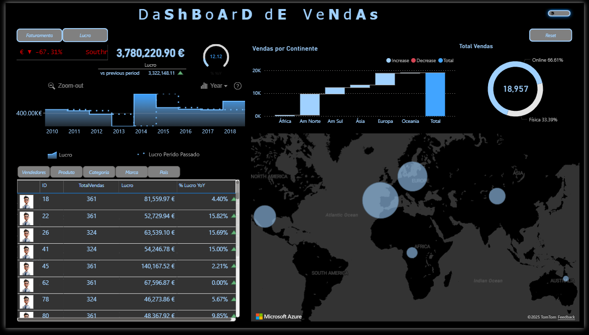

# Sales Dashboard Power BI

## 📊 Overview
This project presents a Sales Dashboard built using Microsoft Excel and Power BI.  
It was developed as part of a Level 5 Data Science course to demonstrate practical skills in dashboard creation and visualization design.
This is my first completely self-made dashboard, with inspirations from ZoomCharts and other fonts.

## 🧠 Objective
The goal of this project was not to analyze real sales data or derive insights, but to practice:
- Structuring and cleaning data in Excel  
- Designing visuals and KPIs in Power BI  
- Creating an interactive dashboard layout

## ⚙️ Tools Used
- **Microsoft Excel** – data cleaning, organization, and formatting  
- **Power BI** – visualization, DAX calculations, and dashboard creation

## 📈 Key Features
- Interactive filters and slicers  
- Dynamic KPIs and charts for sales performance  
- Professional and clean dashboard layout

## 🧩 Dataset
The dataset is synthetic and was provided for educational purposes.  
It does not represent real-world business data.

## 🧾 How to View
1. Open the Power BI file (`Vendas10802Israel.pbix`) included in the repository.  
2. Interact with the visuals and filters to explore the dashboard design.
3. You can also view a preview of the dashboard below:

   
   

---

### 📚 Author
Created by *s02minu*  
Level 5 Data Science Student
